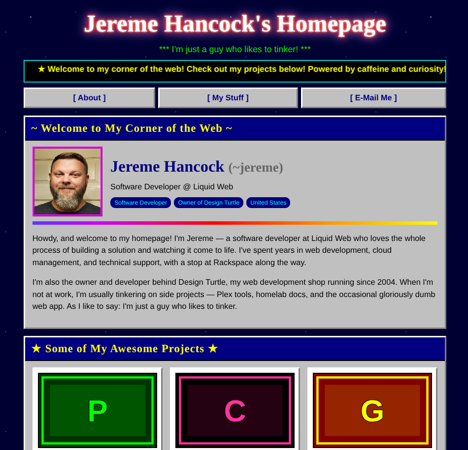

# RetroCities Portfolio Site 🌐

A retro, [GeoCities](https://en.wikipedia.org/wiki/GeoCities)-style personal portfolio
page — neon colors, a scrolling marquee, beveled Windows 95 panels, a starfield
background, and "Best viewed in Netscape" energy — built with plain HTML, CSS, and
vanilla JavaScript. No frameworks, no build step.

All of the page's content (bio, projects, contact links) is kept separate from the
markup in a single `data/data.json` file, so the site can be updated without touching
any code.

## Features

- **Single-page, dependency-free** — just `index.html` plus a JSON file.
- **Content-driven** — text, projects, and links all come from `data/data.json`.
- **Fully responsive** — the layout reflows cleanly from desktop down to mobile.
- **Inline SVG favicon** — no extra image file needed.
- **Authentic '90s styling** — marquee, blinking text, rainbow rules, and pixel-art
  project thumbnails generated on the fly (no image hosting required).
- **Accessible motion** — animations are disabled for visitors who prefer reduced motion.

## Screenshot



## Project structure

```
.
├── index.html        # markup, styles, and all rendering logic
├── data/
│   └── data.json     # all site content (edit this to update the page)
├── images/
│   └── profile.jpg   # profile image
└── README.md
```

## Running it locally

Because the page loads its content with `fetch()`, it needs to be served over HTTP —
opening `index.html` directly from the file system (`file://`) will be blocked by the
browser. Any static server works:

```bash
# Python 3
python3 -m http.server 8000

# or Node
npx serve
```

Then open <http://localhost:8000> in your browser.

## Editing the content

Open `data/data.json` and edit the values — the page reads from it on load. The shape is:

- **`site`** — page title, tagline, scrolling marquee text, and copyright line.
- **`profile`** — name, handle, job title, avatar URL, badges, and bio paragraphs.
- **`projects`** — a list of projects, each with a title, description, list of `tech`
  tags, a `link`, and an optional `image` URL. Leave `image` as `""` to use an
  auto-generated retro placeholder.
- **`contact`** — your email plus a list of labeled links shown in the "Get In Touch"
  section.

No code changes are required to add, remove, or reorder items.

## License

[MIT](LICENSE) © Jereme Hancock

## AI Disclosure

This project was created with the help of AI.
